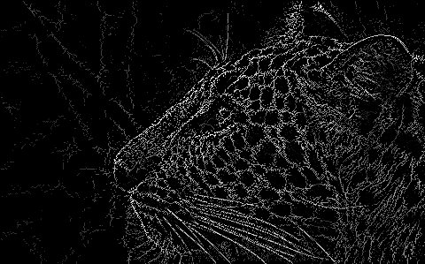

# pyrebel
A pure python library that implements abstraction of data.<br><br>
</img>

# Installation
## From PyPI
```python3 -m pip install --upgrade pyrebel```
## From source
```git clone https://github.com/ps-nithin/pyrebel```<br>
```cd pyrebel```<br>
```python3 -m pip install .```<br>

# Running demo programs
Demo programs are found in 'demo/' directory.
```cd demo/```

# Image abstraction demo
Usage:<br>
```python3 pyrebel_main.py --input <filename.png>```<br><br>
Optional arguments<br>
```--threshold <value>``` Selects the threshold of abstraction. Defaults to 5.<br><br>
For example,<br>
```python3 pyrebel_main.py --input images/abc.png --threshold 10```<br><br>
The output is written to 'output.png'

# Edge detection demo
This is a demo of edge detection achieved using data abstraction.<br>
```python3 pyrebel_main_edge.py --input <filename>```<br>
For eq.
```python3 pyrebel_main_edge.py --input images/small_wildlife.jpg```<br><br>
The output is written to 'output.png'.
Below is a sample input image,<br><br>
</img><br>Below is the output image,<br><br></img>

# Pattern recognition demo
This is a demo of pattern recognition achieved using data abstraction.<br>
1. Learning<br>
   Usage: ```python3 pyrebel_main_learn.py --learn /path/to/image/directory/```<br>
   For eq. running ```python3 pyrebel_main_learn.py --learn images/letters_standard/``` learns all the images
   in the directory and links the filename with the signatures.
2. Recognition<br>
   Usage: ```python3 pyrebel_main_learn.py --recognize <filename>```<br>
   For eq. running ```python3 pyrebel_main_learn.py --recognize images/letters_ripple/c_ripple.png``` displays the
   symbols recognized.
   
To reset the knowledge base just delete file 'know_base.pkl' in the current working directory.
The program expects a single pattern in the input image. Otherwise, a pattern has to be selected by changing variable 'blob_index' accordingly.

# Docs <a href="https://github.com/ps-nithin/pyrebel/blob/main/docs/DOCS.md">here</a>
# Read more about abstraction <a href="https://github.com/ps-nithin/pyrebel/blob/main/docs/intro-r2.pdf">here</a>
# Let the data shine!
