# How does the program learn and recognize patterns? 
Consider two images the first image is to be learned and the second is to be recognized.  
1.</img>&nbsp;2.</img>
  
(a) The first step is to find the farthest points in the pattern. This divides the pattern into two and the points 1 and 2 are the first abstract points. 
3.</img>&nbsp;4.</img>
  
(b) The next step is to find a point fartest from the line joining abstract points in the previous step. Thus, we obtain point 3. 
5.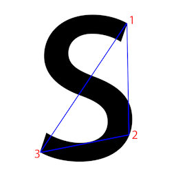</img>&nbsp;6.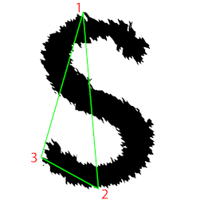</img>
  
(c) The next is to find the signature, which is the concavity or convexity of each abstract points as you travel along the pattern in a specific order (here, clockwise direction).
Thus we get the following signatures. 
7.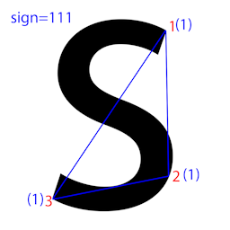</img>&nbsp;8.</img>
  
(c) The process is repeated till the farthest point is less than the threshold. 
9.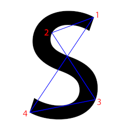</img>&nbsp;10.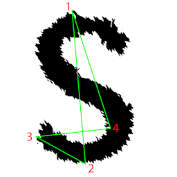</img>
  
11.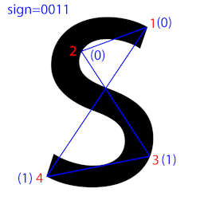</img>&nbsp;12.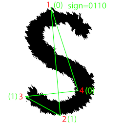</img>
  
13.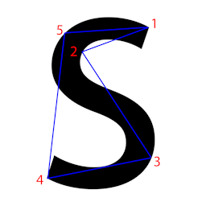</img>&nbsp;14.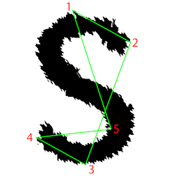</img>
  
15.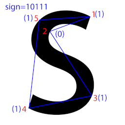</img>&nbsp;16.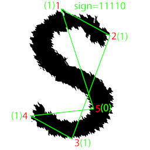</img>
  
17.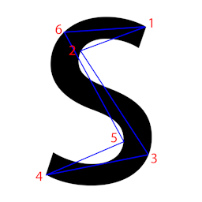</img>&nbsp;18.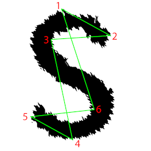</img>
  
19.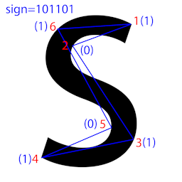</img>&nbsp;20.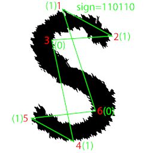</img>
  
