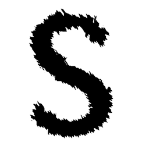
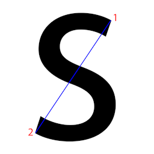
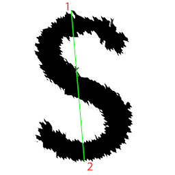

# How does the program learn and recognize patterns? 
Consider two images the first image is to be learned and the second is to be recognized.  
1.</img>&nbsp;2.</img>

# Step 1
The first step is to find the farthest points in the pattern. 
3.</img>&nbsp;4.</img>
