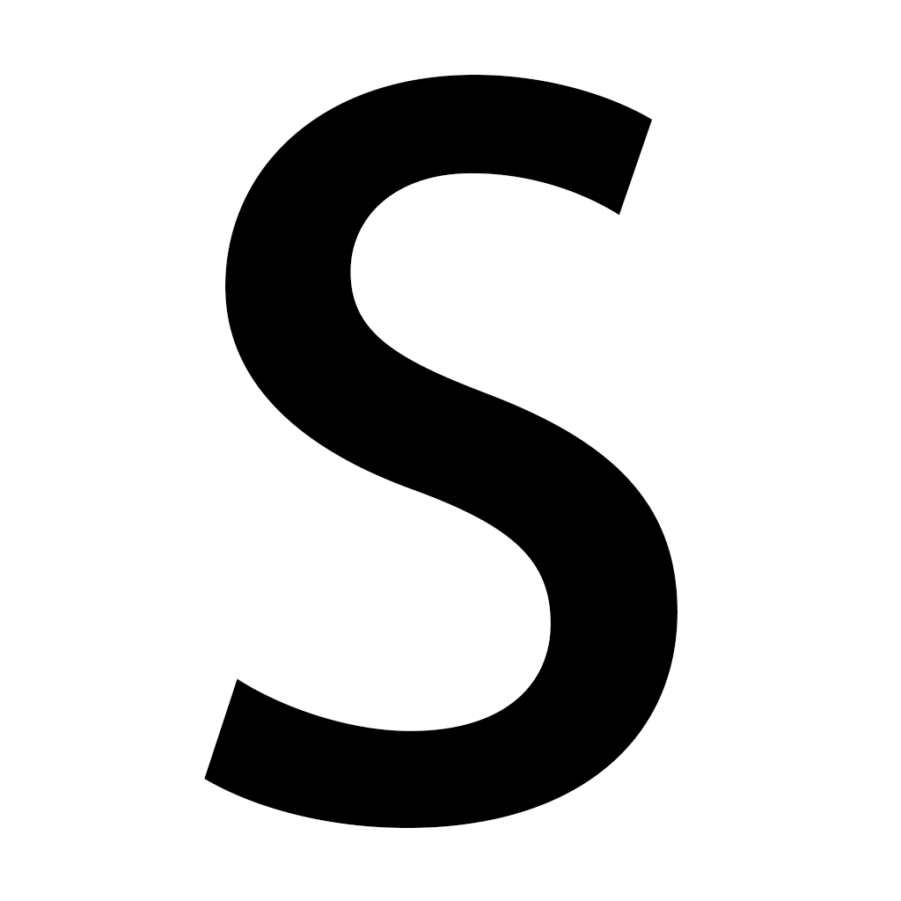
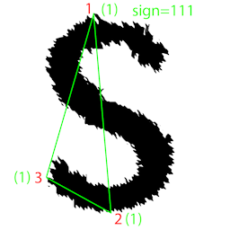
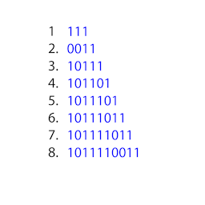

# How does the program learn and recognize patterns? 
Consider two images, the first image is to be learned and the second is to be recognized.  
</img>&nbsp;1.&nbsp;</img>&nbsp;2.
  
(a) The first step is to find the farthest points in the pattern. This divides the pattern into two parts and the points 1 and 2 are the first two abstract points. 
</img>&nbsp;3.&nbsp;</img>&nbsp;4.
  
(b) The next step is to find a point farthest from the line joining abstract points in the previous step. Thus, we obtain the third point. The pattern is now divided into three parts. The abstract points are numbered in order as you travel along the pattern in one direction. (here, clockwise direction starting from point 1) 
</img>&nbsp;5.&nbsp;</img>&nbsp;6.
  
(c) The next step is to find the signature, which is the concavity or convexity of each abstract points as you travel along the pattern in a specific order (here, clockwise direction).
Thus we get the following signatures. 
</img>&nbsp;7.&nbsp;</img>&nbsp;8.
  
(c) The process is repeated till the farthest point is less than the threshold or the program reaches the specified number of layers. Here 10. 
# Layer 4
</img>&nbsp;9.&nbsp;</img>&nbsp;10.
  
</img>&nbsp;11.&nbsp;</img>&nbsp;12.
  
# Layer 5
</img>&nbsp;13.&nbsp;</img>&nbsp;14.
  
</img>&nbsp;15.&nbsp;</img>&nbsp;16.
  
# Layer 6
</img>&nbsp;17.&nbsp;</img>&nbsp;18.
  
</img>&nbsp;19.&nbsp;</img>&nbsp;20.
  
# Layer 7
</img>&nbsp;21.&nbsp;</img>&nbsp;22.
  
</img>&nbsp;23.&nbsp;</img>&nbsp;24.
  
# Layer 8
</img>&nbsp;25.&nbsp;</img>&nbsp;26.
  
</img>&nbsp;27.&nbsp;</img>&nbsp;28.
  
# Layer 9
</img>&nbsp;29.&nbsp;</img>&nbsp;30.
  
</img>&nbsp;31.&nbsp;</img>&nbsp;32.
  
# Layer 10
</img>&nbsp;33.&nbsp;</img>&nbsp;34.
  
</img>&nbsp;35.&nbsp;</img>&nbsp;36.
  
(d) The final step is to compare the signatures. 
</img>&nbsp;37.&nbsp;</img>&nbsp;38.
  
As you can see, the signatures obtained from recognition image (green) matches with the signatures obtained from the learning image (blue).(The signatures may be rotated).
Thus, the image is recognized.
